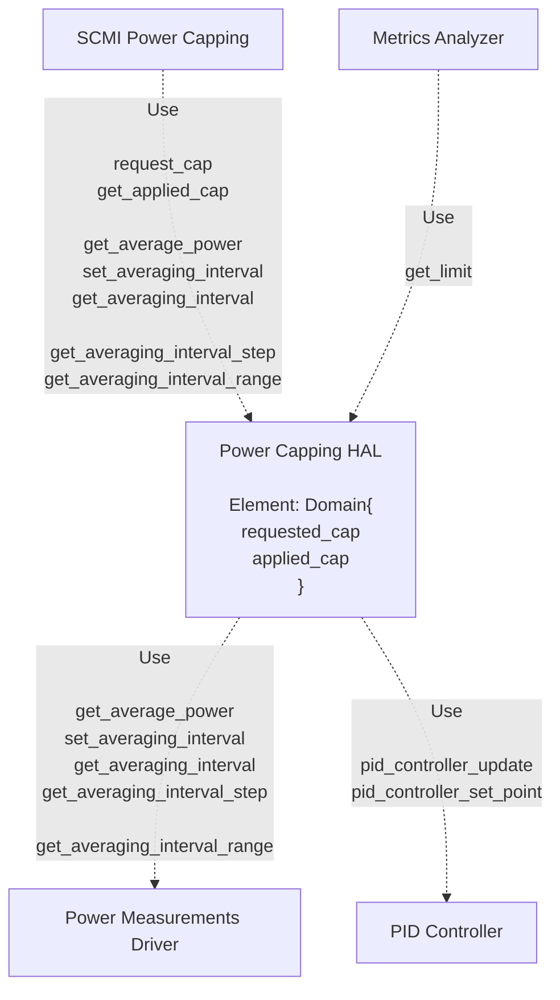
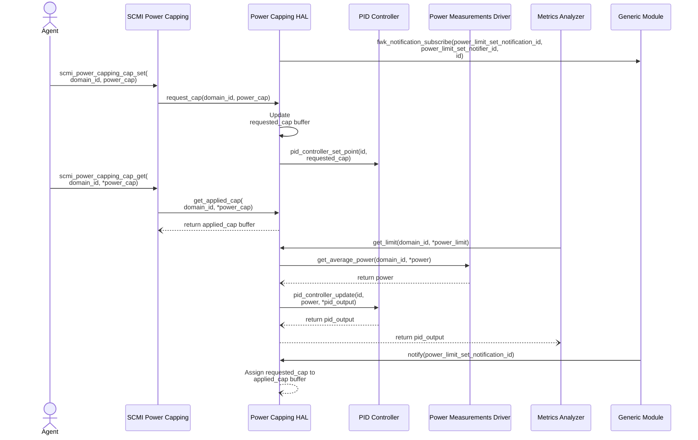
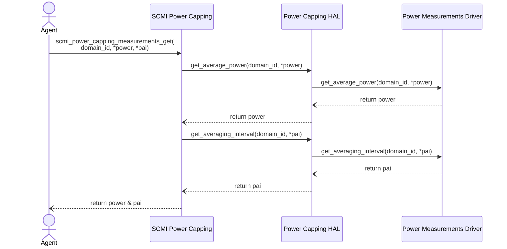
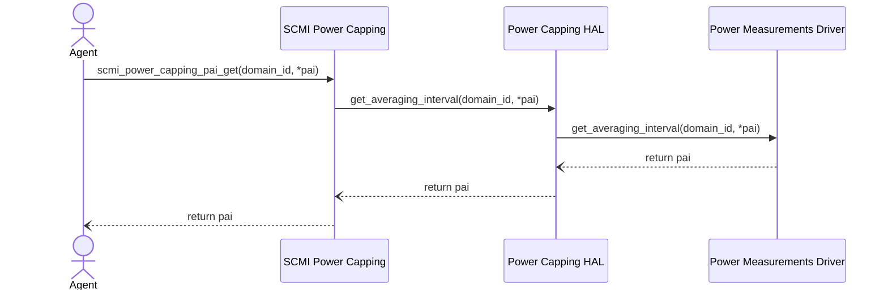
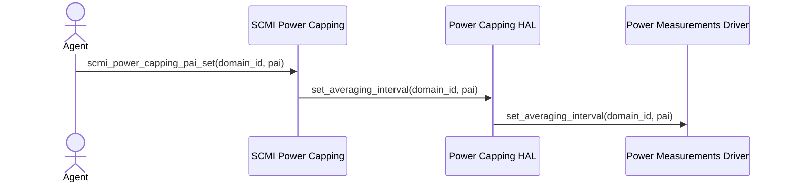
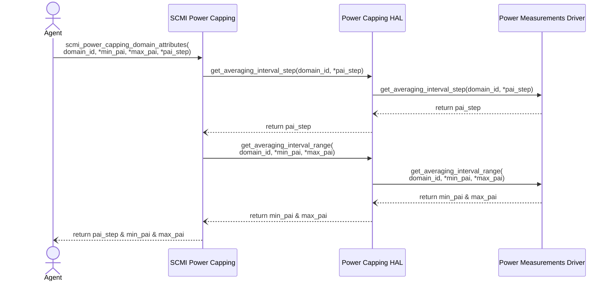

# Power Capping

Copyright (c) 2025, Arm Limited and Contributors. All rights reserved.

## Overview

The Power Capping HAL module is a service responsible for interacting with the
Power Measurements Driver to retrieve the current average power and
power averaging interval. It also provides APIs for SCMI Power Capping,
enabling the configuration of the system’s Power Cap.

Additionally, it applies PID feedback to the Power Cap requested by the agent,
preventing direct enforcement while allowing a margin for
temporary performance bursts.

The module continuously supplies the power limit to the Metrics Analyzer.

## Architecture overview

## Power Capping HAL APIs

| Function  | Description |
|-----------|-------------|
| int request_cap(fwk_id_t domain_id, uint32_t requested_cap) | Set the requested cap|
| int get_applied_cap(fwk_id_t domain_id, uint32_t *cap) | Return applied cap|
| int get_limit(fwk_id_t domain_id, uint32_t *power_limit) | Return requested cap as power limit|
| int get_average_power(fwk_id_t id, uint32_t * power) | Get average power across an averaging interval.|
| int set_averaging_interval(fwk_id_t id, uint32_t pai)	| Set the power averaging interval.|
| int get_averaging_interval(fwk_id_t id, uint32_t *pai) | Get the power averaging interval.|
| int get_averaging_interval_step(fwk_id_t id, uint32_t *pai_step) | Get averaging interval step.|
| int get_averaging_interval_range(fwk_id_t id, uint32_t *min_pai, uint32_t *max_pai) | Get averaging interval range. |

## Operation

### PID controlling operation

### Measurements Get operation

### PAI Get operation

### PAI Set operation

### Domain Attributes operation

